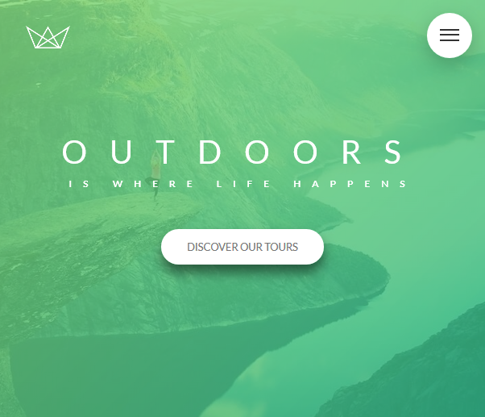

# <a href="https://mahmudul-hasan-bijoy.github.io/Natours-Advanced-CSS/" target="_blank">Natours | Advanced CSS Tricks</a>
  - Onepage Website
  - Advanced CSS Tech includng Nice Animations.
  - HTML5
  - CSS3 [No Framework]
  - SASS
  - Course instructor: <a href="https://github.com/jonasschmedtmann" target="_blank">Jonas Schmedtmann</a>  

  <a href="https://github.com/actions/setup-node/actions?query=workflow%3Abuild-test">
  
# License

